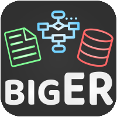

<!-- LOGO -->
<p align="center">
  
</p>

<!-- TITLE -->
<h1 align="center">bigER Modeling Tool</h1>

<!-- BADGES -->
<p align="center">
  
  
  
  
  
</p>

<!-- DESCRIPTION -->
<p align="center">
  <b>ER modeling tool for VS Code supporting hybrid, textual- and graphical editing, multiple notations, and SQL code generation!</b></br>
  <sub><a href="https://marketplace.visualstudio.com/items?itemName=BIGModelingTools.erdiagram">➜ Download for VS Code</a><sub>
</p>

<!-- DEMO -->
<p align="center">
  
</p>

<!-- FEATURES -->
**Main features:**
- 📝 **Textual Language** for ER modeling with *rich-text editing* support through the [Language Server Protocol (LSP)](https://microsoft.github.io/language-server-protocol/). 
- 📊 **Diagram View** that is *fully synchronized* with the model in the textual editor and includes *automatic layout* of elements, *multi-notation support* and a *toolbar* for modifying the diagram representation or underlying model.
- 🖨️ **Code Generation** for *generating SQL tables* from the specified ER model and integrate with existing databases.  

---

<br />	

**📖 Table of Contents**
1. [About the Project](#about-the-project)
2. [Usage](#usage)
3. [Build Instructions](#build-instructions)
4. [Issues](#issues)
5. [Contributing](#contributing)
6. [License](#license)

<br />	

## About the Project

The tool uses a language server for the ER modeling language which communicates its language features through the [Language Server Protocol (LSP)](https://microsoft.github.io/language-server-protocol/). This makes bigER highly reusable, increases perfomance and simplifies implementation for other editors that also use the LSP. 

The language and editor features are realized with the [Xtext](https://www.eclipse.org/Xtext/) language workbench, while [Sprotty](https://github.com/eclipse/sprotty) with a [Sprotty-enhanced Graphical Language Server](https://github.com/eclipse/sprotty-server) is used for rendering the diagrams. All of this is integrated with VS Code by implementing a [Sprotty VS Code Extension](https://github.com/eclipse/sprotty-vscode).


<!-- USAGE -->
## Usage

In the following we describe the basic usage of the tool based on a simple example. See the documentation in the [bigER Wiki](https://github.com/borkdominik/bigER/wiki/) or check out other [Examples](https://github.com/borkdominik/bigER/tree/main/examples) to learn more.

**Installation**

Download and install the extension from the [VS Code Marketplace](https://marketplace.visualstudio.com/items?itemName=BIGModelingTools.erdiagram). For more information regarding installation see the [Extension Marketplace](https://code.visualstudio.com/docs/editor/extension-marketplace) guide for VS Code.


**Textual Model**

Once the extension is installed a new ER model can be created. Models are created in `.erd` files, refer to the example below to specify a basic model consisting of two entities and a *one-to-many* relationship. 

```java
// File: example.erd
erdiagram Example
generate=sql

entity Customer {
    id: int key
    name: string
}

entity Order {
    order_number: int key
    price: double
}

relationship Places {
    Customer[1] -> Order[N]
}
```

**Diagram**

Open the diagram through the button in the editor or by right-clicking on the `.erd` file.


**Code Generator**

Code generation is controlled through the `generate` keyword. Since we specified the `sql` value, the SQL code generator is enabled and the generated code contained in the newly created `src-gen/Example.sql` file.

```sql
CREATE TABLE Customer(
	id int,
	name string,
	PRIMARY KEY (id)
);

CREATE TABLE Order(
	price double,
	order_number int,
	PRIMARY KEY (order_number)
);

CREATE TABLE Places(
	id int references Customer(id),
	order_number int references Order(order_number),
	PRIMARY KEY (id, order_number)
);
```

<!-- BUILD INSTRUCTIONS -->
## Build Instructions

**Prerequisites**

- [Node.js](https://nodejs.org/en/) runtime
- [yarn](https://yarnpkg.com/) package manager
- [Java](http://jdk.java.net/) (11+)
- [VS Code](https://code.visualstudio.com/) (v1.50+)


Download or clone the repository and in the root folder of the project execute the following commands:

```bash
language-server/gradlew -p language-server/ build 
yarn --cwd webview  
yarn --cwd extension
```

After building the project, the extension can be run in VS Code by pressing <kbd>F5</kbd> or through <kbd>Run -> Start Debugging</kbd> from the menu


<!-- TODO: Add to Wiki
The code is split into a **client side** (extension with webview) and a **server side** (language with LSP and diagram server). It is recommended to use  **VS Code** for the client code, written in *TypeScript* and **Eclipse** for the server side, based on *Java*. Eclipse must be compatible with Xtext and Xtend (e.g. [Eclipse IDE for Java and DSL Developers](https://www.eclipse.org/downloads/packages/release/juno/sr2/eclipse-ide-java-and-dsl-developers)) and create a new workspace to avoid configuration issues. Import the language server as a Gradle project (<kbd>File -> Import -> Existing Gradle Project</kbd>) and override the workspace settings.
-->

<!-- ISSUES -->
## Issues

Project issues are managed on GitHub, see [Open Issues](https://github.com/borkdominik/bigER/blob/main/docs/ISSUES.md) for the currently tracked issues. Do not hesitate to report a bug or request a feature through the offered [Issue Templates](https://github.com/borkdominik/bigER/issues/new/choose). For questions, simply use a blank issue.


<!-- CONTRIBUTING -->
## Contributing

Contributions to the project are always welcome! See the [Contribution Guidelines](https://github.com/borkdominik/bigER/blob/main/docs/CONTRIBUTING.md) for more information.

**Contributers**:
- [Philipp-Lorenz Glaser](https://github.com/plglaser) (main developer)   
- [Georg Hammerschmied](https://github.com/SchmiedHammer)  (multi-notation support)
- [Hnatiuk Vladyslav](https://github.com/Aksem) (improved edge router)
- [Dominik Bork](https://github.com/borkdominik)


See [All Contributors](https://github.com/borkdominik/bigER/graphs/contributors).

<!-- LICENSE -->
## License 

The project is distributed under the MIT License. See [License](https://github.com/borkdominik/bigER/blob/main/LICENSE) for more details.
