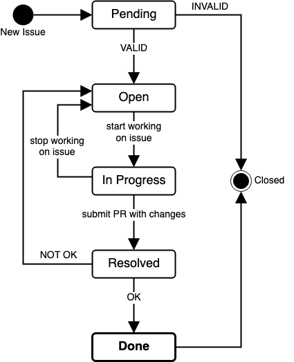

# Issue Tracking

This page describes the issue tracking process of [bigER](https://github.com/borkdominik/bigER). 

<!-- See currently [open](https://github.com/borkdominik/bigER/issues) and [closed](https://github.com/borkdominik/bigER/issues?q=is%3Aissue+is%3Aclosed) issues of the project. -->

<!-- TABLE OF CONTENTS -->
**📖 Table of Contents**
1. [Status Workflow](#status-workflow)
2. [Types of Issues](#types-of-issues)
3. [Milestones](#milestones)

 

<!-- STATUS WORKFLOW -->
## Status Workflow

All open issues receive a label to indicate the current **status**. The status label can have the following values:
- `Open` - Verified and open for implementation
- `In Progress` - Already worked on by a developer
- `Review` - Ready for review
- `Done` - All tasks completed

The image illustrates how issues transition between the different states, see below for a description.

New issues are verified and labeled by a code owner. Valid issues become `Open` for implementation, otherwise invalid issues get closed (see [Types of Issues](#type-of-issues) for reasons). 

When a developer starts working on an open issue, it is set to `In Progress`. If they decide to stop working on the issue, it goes back to an open state. 

Issues are ready for review when a Pull Request (PR) is submitted, receiving the `Review` status label. Again, a code owner reviews the PR and decides whether the submitted changes solve the issue. If the review is *OK*, the issue receives the `Done` status label and can be closed, otherwise when *NOT OK* it goes back to `Open`.

<!-- TYPES OF ISSUES -->
## Types of Issues

Besides the status label, issues are also classified based on their **type**. Currently we use the following labels for classification:
- `bug` - Problems related to bugs
- `discussion` - Discussion or question
- `dev` - Improvements to the development experience
- `docs` - Improvements or additions to documentation
- `duplicate` - Duplicate of an existing issue
- `feature` - Request new changes
- `help` - Support needed
- `needs more info` - Missing information to be valid
- `won't do` - Currently cosidered out of scope and will not be worked on

<!-- MILESTONES -->
## Milestones

[Milestones](https://github.com/borkdominik/bigER/milestones) are created for new releases and are used for tracking which version fixes an issue. In case no milestone is specified, fixes regarding the issue are not considered to be included in the next release.

