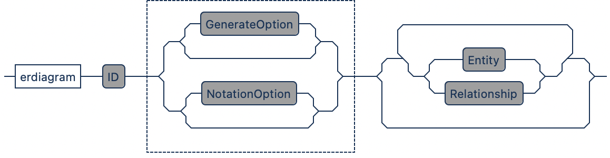
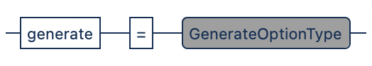
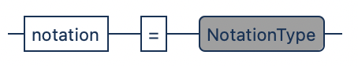
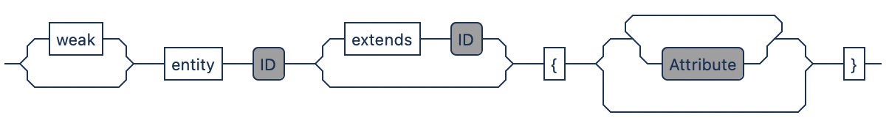
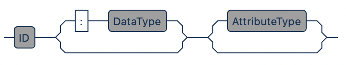
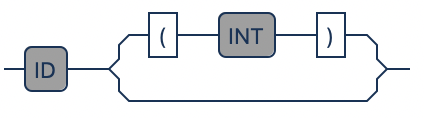
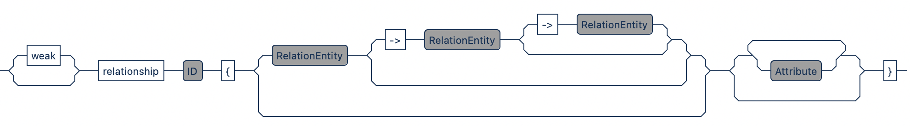
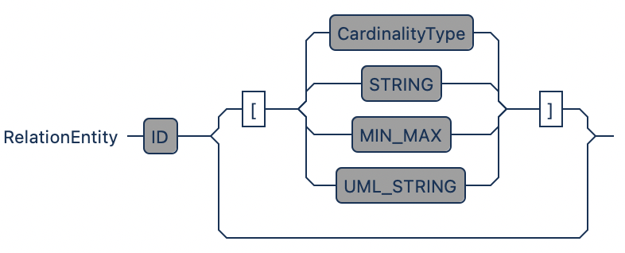

# Language Guide

<!--  -->

**Table of Contents**  
- [Comments](#comments)  
- [ER Model](#er-model)
   - [Generator](#generator)
   - [Notation](#notation)
- [Entity](#entity)
   - [Weak Entity](#weak-entity)
   - [Inheritance](#inheritance)
- [Attributes](#attributes)
   - [DataType](#datatype)
   - [Classifiers](#classifiers)
- [Relationship](#relationship)
  - [Degree](#degree)
  - [Cardinality](#cardinality)


## Comments

```java
// single-line comment

/*
    multi-line comment
*/
```

## ER Model

<!-- Each ER model requires a header that is located at the top and includes the `erdiagram` keyword with a *name* for the model. -->



```java
// Header
erdiagram ModelName

// Options
generate=off // optional
notation=default // optional

// Entities and Relationships ...
```


### Generator

<!-- Controls the Code Generator. -->



| Option | Description  |
|---|---|
| `off`  | Turns the code generator off.   |
| `sql`  | Generate SQL tables in form of `CREATE TABLE` statements.  |


### Notation

<!-- Changes the notation of the corresponding ER diagram. -->



**Options**

| Option  | Description  |
|---|---|
| `default`  | Default Notation  |
| `chen`  | Chen Notation |
| `minmax`  | Min-Max Notation |
| `bachman` | Bachman Notation |
| `crowsfoot` | Crow's Foot Notation |
| `uml` | UML Notation |


## Entity

<!-- Entities are specified through the `entity` keyword followed with a *name* (ideally in upper-case). Optionally, the preceeding `weak` keyword defines entities as *weak*, and entities can *extend* another entity to inherit the attributes when using `extends`. Attributes are defined within curly braces. -->



```java
// Basic Entity
entity Basic {}

// Entity with Attributes
entity WithAttr { 
    attr1 key
    attr2
}
```

### Weak Entity

```
entity StrongEntity {
    attr key
}

weak entity WeakEntity { 
    attr partial-key
}

weak relationship depends {
    WeakEntity -> StrongEntity
}
```


### Inheritance

> ⚠️ (experimental)

```
entity Vehicle {
    manufacturer
    cost
}

entity Car extends Vehicle {
    serial_nr
}
```


## Attributes



```java
// Basic
attr

// Datatype
attr: VARCHAR(255)
attr : integer

// Classifiers
attr key
attr partial-key 
attr optional
attr derived
attr multi-valued
```

### DataType



### Classifier

| Classifier  | Description  |
|---|---|
| `none`  | Simple |
| `key`  | Key attributes uniquely identify entities |
| `partial-key`  | Partial key, used for weak entities |
| `optional` | Optional attributes can have no value (i.e., *NULL*)  |
| `derived` | Can be derived from another attribute (e.g., *age* from *birthday*) |
| `multi-valued` | UML Notation |

## Relationship

<!--
**Relationship**
```weak? relationship ID { RE -> RE -> RE }```
-->


<!--
**RelationEntity**
```
Entity[ CARDINALITY | "STRING" ]
```
-->



<!-- 
**Examples**
```
relationship Rel1 { }

relationship Rel2 { 
    attr
}

relationship Rel3 { 
    E1
    attr
}
```
-->

### Degree

<!-- The degree *n* refers to the amount of entities participating in a relationship, which can be *binary* (*n*=2) or *ternary* (*n*=3). There is also the option for self-references through a  *recursive relationship*.-->

```
relationship Binary {
    E1 -> E2
}

relationship Ternary {
    E1 -> E2 -> E3 
}

relationship Recursive {
    E1 -> E1
}
```


### Cardinality

```
relationship OneToOne {
    E1 [1] -> E2 [1]
}

relationship OneToMany {
    E1 [1] -> E2 [N]
}

relationship ManyToMany {
    E1 [N] -> E2 [N]
}

relationship Custom {
    E1 ["custom"] -> E2 ["(1, *)"]
}
```

